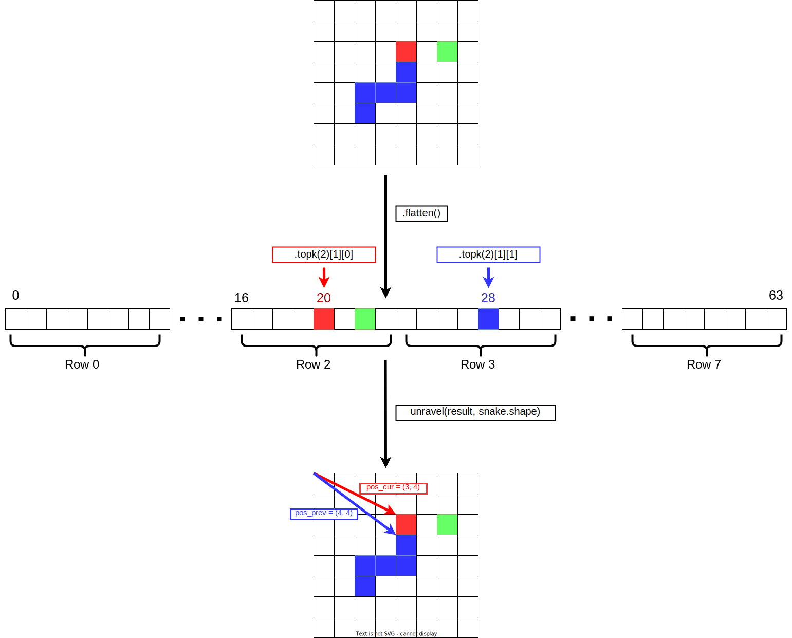

# How to write a game of snake in 12 lines of code

First of all a want to declare this article the founding document of snaketronics.

> Snaketronics:
>
> The scientific pursuit of the nature of computational snakes and all their
> implementations and applications in modern society

Secondly, there is a disclosure. Before you start screaming
about line length, all of the lines are in fact PEP 8 compliant.

We are also programming a version of Snake where the snake can loop around the
screen. However, you can change 2 lines to produce the original version of snake,
but I will leave that as an exercise for the reader.

We will be using `PyTorch` and `NumPy`. This
could have been done completely in either, but I prefer the `PyTorch` tensor
API and `NumPy` has a nice function called `unravel_index` that we will be using.

I will not be counting the imports and function declaration; call it freedom of
artistic expression. The code is also
not very readable, sensible, or proper in any way, shape, or form. But, sometimes
it is important to not write code that is "correct", but to write code that is fun.

```python
import torch as t
from torch import tensor as T
from numpy import unravel_index as unravel
import matplotlib.pyplot as plt

def do(snake, action):
    '''This is where the magic happens :) '''
```

Now that we've got all of the formalities out of the way there is only one thing
left to say:

Buckle up Buckaroo, because this is going to be a wild ride!

## Encodings


The crucial part of this code is the encoding of the snake state. As any computer
scientist worth his or her salt should know: It's all about the data, baby!

We want the encoding to be a matrix such that if displayed with `plt.imshow` it shows a
playable game of Snake. It also needs to encode all of the information needed
to play Snake in a manner that makes it easy to update.

For this reason, we will encode the state as a matrix of integers where every open
cell in the game is `0`, the tail of the snake is `1`, every cell of the snake increases
by `1` towards the head and the food is `-1`. So, for a snake of size `N`, the tail will
be `1` and the head will be `N`.

Next, we will be using a slightly odd encoding for actions. Instead of the traditional
`[up, right, down, left]` encoding we will be stealing the action encoding from
the article [Teaching a computer how to play Snake with Q-Learning](
https://towardsdatascience.com/teaching-a-computer-how-to-play-snake-with-q-learning-93d0a316ddc0)
by Jason Lee. This encoding is `[left, straight, right]` relative to the current snake direction.
This is slightly harder to play for a human, but every action is always a valid action since
you can't go backwards.

# Code

With an absolute banger of encoding in place, we can pick up where we left off and get into the
trenches of actually writing code.

I will not be providing in-depth explanations of the functions I am using. This is both because
all of the functions are from the `PyTorch` API and these are well documented already. Also,
it is good practice to learn to read the documentation in order to get familiar with
the `PyTorch` terminology.

I highly suggest having a tab open with the [PyTorch API documentation](https://pytorch.org/docs/stable/index.html)
while reading this article.

## Getting the current position



The first thing to do is to get the current and previous
position of the snake head. We can do this with the `topk(2)`, since the head of the snake
is always the largest int and the previous head is the second largest. The only problem we have
is that the `topk` method works along one dimension at a time. For this reason, we need to `flatten()`
the tensor first, get the top k elements then use the aforementioned `unravel_index` to convert it back
to a 2d index. At last, we want to turn the two indices into tensors so that we can do the math on
them as well.

```python
positions = snake.flatten().topk(2)[1]
[pos_cur, pos_prev] = [T(unravel(x, snake.shape)) for x in positions]
```

## Calculating the next position


To calculate the next position we do `pos_cur - pos_prev`. This yields a vector
pointing in the current direction of travel of the snake. Next, we want to rotate it, but how much?

We want to rotate it `(270 + 90 * action)` degrees. This way when `0` is given as an action we turn left,
`1` we travel straight, and `2` turn right.

To achieve this we apply a rotation matrix. If a matrix is applied to itself it gives us a matrix
that is equivalent to applying the transformation twice. Therefore, we can take the direction
vector and apply a 90-degree counter-clockwise rotation matrix (`T([[0, -1], [1, 0]])`) raised
to the power of `3 + action`.

Finally, we add the current position to this new direction vector to produce the next position.
Then we take the new location and take the pairwise modulus with the size of the board to generate
the wrap around functionality.

```python
rotation = T([[0, -1], [1, 0]]).matrix_power(3 + action)
pos_next = (pos_cur + (pos_cur - pos_prev) @ rotation) % T(snake.shape)
```

## How to die

Ah, the age-old question. Oh wait, what were we talking about? That's right, snakes, never mind!

Since we now have the next position, it is fairly trivial to figure out whether the snake should
die or not. We just have to check if `snake[tuple(pos_next)] > 0` since the only values with more then
`0` on our board is the value where the snake currently is.

If the snake is dying, we want to return the score of the current game. This is also fairly
trivial since the score of the game is the same as the length of the snake minus 2 (assuming
we start the game at snake length 2). To get the length, we just have to get the value of
`pos_cur` since this is the current head of the snake. That means the current score is
`snake[tuple(pos_cur)] - 2`.

```python
if (snake[tuple(pos_next)] > 0).any():
    return (snake[tuple(pos_cur)] - 2).item()
```

## How to eat


Time to brace yourself; the next 3 lines are the most complicated in the game.

To check if the snake is eating, we check if `snake[pos_next]` is `-1`. If this is the case
then we need to find all positions on the board which are currently `0`. These
are empty cells where we can potentially put food.

When we have all of these positions, we need to select one of these indices at random
and update its value to be `-1`. We don't need to edit the current `-1` entry as
the snake will overwrite it when it moves.

To find all the places that are currently `0`, we just use `snake == 0` (this returns
a boolean tensor). Next, we do `.multinomial(1)` on this to select one at random. The
`multinomial(n)` function samples `n` random indices from a tensor with a probability
based on the value of the element.

However, `multinomial` works row-wise (like `topk`) as well as only taking floats. Therefore,
we need to do both `.flatten()` and `.to(t.float)` first. This way, each index where the
value equals `0` has the same probability of being picked, and every index where the
value does not equal `0` has a zero probability of being picked.

Once this is done we need to `unravel` it again to get a 2d index and update the `snake`
tensor.

```python
if snake[tuple(pos_next)] == -1:
    pos_food = (snake == 0).flatten().to(t.float).multinomial(1)[0]
    snake[unravel(pos_food, snake.shape)] = -1
```

## How to move


To move the snake, we shrink the current snake and append a new head at
the next position.

However, we only want to shrink the snake if we are not eating. If we are
eating, then we want to extend the size by 1 cell.

Therefore, we append an `else` clause on the previous `if` statement to shrink the snake.
Since the snake is numbered and the last tail cell is `1`, we can subtract `1` from every
cell on the grid larger than `0`.
This is because every cell in the grid larger then `0` will be a cell representing the body
of the snake. Thus, doing this will shrink the snake by one cell.

To append the new head, we need to set the next position to the value of the current
position plus 1.

```python
else:
    snake[snake > 0] -= 1

snake[tuple(pos_next)] = snake[tuple(pos_cur)] + 1
```
## Summary

So, that's it. There you go. Snake in 12 lines.

```python
def do(snake: t.Tensor, action: int):
    positions = snake.flatten().topk(2)[1]
    [pos_cur, pos_prev] = [T(unravel(x, snake.shape)) for x in positions]
    rotation = T([[0, -1], [1, 0]]).matrix_power(3 + action)
    pos_next = (pos_cur + (pos_cur - pos_prev) @ rotation) % T(snake.shape)

    if (snake[tuple(pos_next)] > 0).any():
        return (snake[tuple(pos_cur)] - 2).item()
    if snake[tuple(pos_next)] == -1:
        pos_food = (snake == 0).flatten().to(t.float).multinomial(1)[0]
        snake[unravel(pos_food, snake.shape)] = -1
    else:
        snake[snake > 0] -= 1

    snake[tuple(pos_next)] = snake[tuple(pos_cur)] + 1
```

## Interface

Oh, you want to play it as well?!

Originally this was written as an RL environment so I had no interface for it, but
for you, I'll make one. However, it'll cost you 15 more lines. Classic user interface
code always has to be so complicated...

Here you go:

```python
snake = t.zeros((32, 32), dtype=t.int)
snake[0, :3] = T([1, 2, -1])

fig, ax = plt.subplots(1, 1)
img = ax.imshow(snake)
action = {'val': 1}
action_dict = {'a': 0, 'd': 2}
action_dict.setdefault(1)

fig.canvas.mpl_connect('key_press_event', lambda e:
                       action.__setitem__('val', action_dict[e.key]))

score = None
while score is None:
    img.set_data(snake)
    fig.canvas.draw_idle()
    plt.pause(0.1)
    score = do(snake, action['val'])
    action['val'] = 1

print('Score:', score)
```

So, now you can play Snake to your heart's content. But, remember, if you think this
was too easy, this is only the first snaketronics article. This was merely a pre-requisite.
I've got something juicy in the pipeline. So stay on the lookout!
